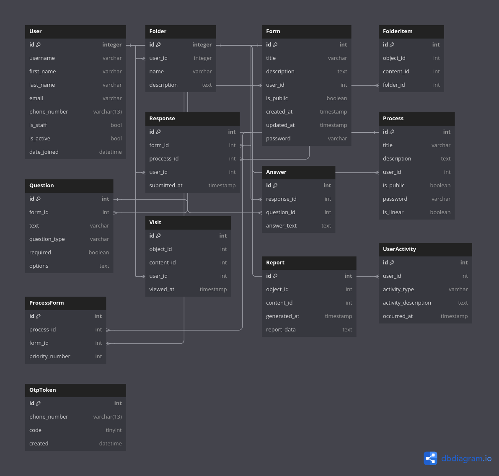

# Porsojo


---
A survey system with the ability to store, display and monitor dynamic forms and processes reporting their results.

## Table of Contents

- [Features](#features)
- [Technologies](#technologies)
- [Project ERD](#project-erd)
- [Installation](#installation)
- [License](#license)
- [Authors](#authors)

## Features

- **User Registration and Authentication**: Secure register and login and authentication with JWT
- **Create Proccess and Forms**
- **Categorize forms and processes**
- **Giving online reports for forms and processes**
- **Weekly and monthly summary reports for admin**

## Technologies

- **Django**
- **Django rest framework**
- **Jwt authentication**
- **Postgresql/Sqlite database**
- **Celery for background tasks**
- **Redis for caching**
- **RabbitMQ for celery backend**

## Project ERD



## Installation

### Install locally

```bash
python -m virtualenv venv
source venv/bin/activate
pip install -r requirements.txt
python manage.py runserver
```

### Docker

```bash
docker compose build
docker compose up
```

## License

[MIT LICENCE](LICENSE)

## Authors

- [@khodealib](https://www.github.com/khodealib)
